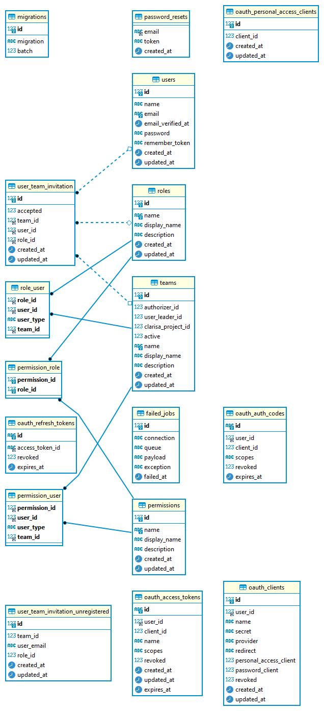

# TOC (Theory Of Change) Tool

The Theory of Change Tool aims to formalize and streamline the creation of Theories of Change (ToCs) for CGIAR activities at different levels of maturity.

It has been developed by [SCiO](https://scio.systems) based on the CGIAR ToC Guidance Directive and builds on the ToC Data Model informing the structure of its knowledge base.

The tool is built as a web application, with clearly decoupled frontend and backend components. The communication between the components is realised via a broad set of REST API calls. The calls are meant for internal usage by the tool but can be used in the future to expose information in other applications.

Further documentation that contributes to the understanding of the API organisation is provided in the accompanying [Data Model Summary Report](TOC Tool Data Model.pdf) and the online documentation for the ontology that represents the model using W3C Semantic Web standards and specifications.

## ToC Tool Backend

The section provide instructions on the deployment and configuration of the tool's backend components.

The provided installation and configuration guidelines assume that the following services are installed on a machine running Ubuntu 18.04:

- [Apache Web Server](https://httpd.apache.org)
- [Certbot](https://certbot.eff.org) (optional)
- [Composer](https://getcomposer.org) dependency manager
- [MongoDB Community Server](https://www.mongodb.com/try/download/community)
- [MongoDB PHP Driver](https://docs.mongodb.com/drivers/php/)
- [MySQL Community Server](https://dev.mysql.com/downloads/mysql/)
- [PHP](https://www.php.net)  v7.2 or newer
- [Laravel](https://laravel.com) v7 or newer
- [GraphDB](https://graphdb.ontotext.com) free edition, v9.8 or later

### Installation of required services

#### PHP and Composer

Consider using [this guide](https://www.digitalocean.com/community/tutorials/how-to-install-php-7-4-and-set-up-a-local-development-environment-on-ubuntu-20-04) for installing PHP 7.4 and its additional modules. The guide also covers the installation of Composer, a dependency manager used by Laravel.

Additional PHP packages required can be installed by running the following snippet from the command line:

`sudo apt-get install -y php7.4-cli php7.4-json php7.4-common php7.4-mysql php7.4-zip php7.4-gd php7.4-mbstring php7.4-curl php7.4-xml php7.4-bcmath`

#### MongoDB and MongoDB Driver

The MongoDB driver is is required for Laravel to operate. MongoDB itself is required but it can also be hosted on a different machine from your Laravel project, hence, its installation is optional. To install the MongoDB driver for PHP you can use the following guide section labeled ["How to install MongoDB PHP drivers"](https://websiteforstudents.com/install-mongodb-with-apache2-php-7-2-support-on-ubuntu-16-04-17-10-18-04/).

#### MySQL

MySQL can be hosted on a different machine than the one Laravel is hosted. For that reason, this installation is optional, like MongoDB. A  [guide](https://www.digitalocean.com/community/tutorials/how-to-install-mysql-on-ubuntu-18-04) describing every step of MySQL's installation is available.

#### Certbot

Certbot can be installed by using the following guide:  https://www.digitalocean.com/community/tutorials/how-to-secure-apache-with-let-s-encrypt-on-ubuntu-18-04 . The reason certbot is needed, is to allow HTTPS certification of your domain. There are other options to issue an HTTPS certificate for your Laravel application.

#### GraphDB

GraphDB free version provides [a comprehensive guide](https://graphdb.ontotext.com/documentation/free/quick-start-guide.html#quick-start-guide-run-gdb-as-standalone-server) for installation and configuration. No specialised parameters need to be set for deploying and running the server.

### Backend Installation

For the installation of the backend of the ToC tool, you need to copy the repo on your machine's `/var/www/html/`:

1. cd to the directory: `cd /var/www/html/`
2. Git the following repo branch: `sudo git clone --branch=release/development https://GiorgosGscio@bitbucket.org/sciocore/toc.git`.

A new directory named `toc` will be present if everything went OK. 

Enter the directory using: `cd toc`.

Once on the `toc` directory, use the following commands:

**Note:** Some of the following commands might require `sudo` in order to complete successfully, depending on your Composer configuration and user permissions.

`composer update;`

`composer install`

Once the update and the installation is complete, a `.env` file is required in order for Laravel to operate. 

To create a `.env` file use: `sudo cp .env.example .env`.

Once an `.env` file is created, use `sudo php artisan key:generate` to generate a application key.

After the creation, the `.env` values must be configured for `MongoDB`, `MySQL`, `Clarisa` and `Auth0` connections. To do so, we use:

`sudo nano .env` or `sudo vi .env`

The values that must be added are the ones that follow. Note the value names that **MUST** remain the same for proper operation.

```
db_connection=mysql
db_host=<MYSQLHOST>
db_port=<MYSQLPORT>
db_database=<MYSQLDB_NAME>
db_username=<MYSQLDB_USERNAME>
db_password=<MYSQLDB_PASSWORD>

mongo_host=<MONGODB_HOST>
mongo_port=<MONGODB_PORT>
mongo_database=<MONGODB_NAME>
mongo_username=<MONGODB_USERNAME>
mongo_password=<MONGODB_USER_PASSWORD>
mongo_authentication_database=

auth0_logout=http: <AUTH0_LOGOUTURL>
auth0_domain=auth0domain.Eu.Auth0.Com
auth0_client_id= <AUTH0_CLIENT_ID>
auth0_client_secret= <AUTH0_CLIENT_SECRET>
api_identifier= <AUTH0_API_URL>

CLARISA_USERNAME== <CLARISA_USERNAME>
CLARISA_PASSWORD= <CLARISA_PASSWORD>
```

Complete the configuration of the `.env` file and save.

Once all the information is provided for MySQL, use the following application to create all the MySQL tables and required data:

`php artisan migrate:fresh --migrate --seed`

##### Allowing public access to the application (configuring `.conf` files)

In order for the application to appear on other devices and not only to local network environments, a configuration file is required for Apache. To create a new file use the following command:

`sudo cp /etc/apache2/sites-available/000-default.conf <DESIRED_NAME>.conf`

then edit `toc.conf` file to match the following. Do note, some values must be modified according to your domain:

```
<virtualhost *:80>
serveradmin webmaster@localhost
servername <DOMAIN_VALUE>
serveralias <DOMAIN_VALUE>
documentroot /var/www/html/toc/public

<directory /var/www/html/<NAME>/public>

options indexes followsymlinks multiviews
allowoverride all
order allow, deny
allow from all
require all granted
</directory>

errorlog ${apache_log_dir}/error. Log
customlog ${apache_log_dir}/access. Log combined

</virtualhost>
```

to activate the newly configured `.conf` file use: `sudo systemctl a2ensite <DESIRED_NAME>.conf`.

Restart the apache service using: `sudo systemctl reload apache2`.

After that, you can test the operation of the new `.conf` file by visiting from any browser your defined `servername`.

The desired result should be a page showing `TOC`.

###### Add HTTPS to your API domain

In order for your API to run in HTTPS form you can use the following command. Do note, that if certbot is not correctly configured or not installed, an error will be thrown. We assume that the domain name will change to this command according to your own domain.

`sudo certbot --apache -d toc.test -d toc.test`

#### MongoDB

For MongoDB, no additional configuration is required. Only the proper values to `.env` are needed for proper operation of MongoDB.

MongoDB is used for storing the following data.

##### ToC data

- Initiative (n-1) level
- Work Package (n-2) level

###### JSON Schema

```json
{
    "$schema": "http://json-schema.org/draft-06/schema#",
    "$ref": "#/definitions/Welcome5",
    "definitions": {
        "Welcome5": {
            "type": "object",
            "additionalProperties": false,
            "properties": {
                "_id": {
                    "$ref": "#/definitions/ID"
                },
                "deleted": {
                    "type": "boolean"
                },
                "version": {
                    "type": "integer"
                },
                "number": {
                    "type": "integer"
                },
                "toc_id": {
                    "type": "string"
                },
                "tocFlow_id": {
                    "type": "string"
                },
                "toc_type": {
                    "type": "string"
                },
                "toc_type_id": {
                    "type": "integer"
                },
                "toc_title": {
                    "type": "string"
                },
                "toc": {
                    "$ref": "#/definitions/Toc"
                },
                "published": {
                    "type": "boolean"
                },
                "published_data": {
                    "$ref": "#/definitions/PublishedData"
                },
                "updated_at": {
                    "$ref": "#/definitions/AtedAt"
                },
                "created_at": {
                    "$ref": "#/definitions/AtedAt"
                }
            },
            "required": [
                "_id",
                "created_at",
                "deleted",
                "number",
                "published",
                "published_data",
                "toc",
                "tocFlow_id",
                "toc_id",
                "toc_title",
                "toc_type",
                "toc_type_id",
                "updated_at",
                "version"
            ],
            "title": "Welcome5"
        },
        "ID": {
            "type": "object",
            "additionalProperties": false,
            "properties": {
                "$oid": {
                    "type": "string"
                }
            },
            "required": [
                "$oid"
            ],
            "title": "ID"
        },
        "AtedAt": {
            "type": "object",
            "additionalProperties": false,
            "properties": {
                "$date": {
                    "type": "string",
                    "format": "date-time"
                }
            },
            "required": [
                "$date"
            ],
            "title": "AtedAt"
        },
        "PublishedData": {
            "type": "object",
            "additionalProperties": false,
            "properties": {
                "narrativeUrl": {
                    "type": "string",
                    "format": "uri",
                    "qt-uri-protocols": [
                        "https"
                    ],
                    "qt-uri-extensions": [
                        ".txt"
                    ]
                },
                "imageUrl": {
                    "type": "string",
                    "format": "uri",
                    "qt-uri-protocols": [
                        "https"
                    ],
                    "qt-uri-extensions": [
                        ".png"
                    ]
                }
            },
            "required": [
                "imageUrl",
                "narrativeUrl"
            ],
            "title": "PublishedData"
        },
        "Toc": {
            "type": "object",
            "additionalProperties": false,
            "properties": {
                "narrative": {
                    "type": "null"
                },
                "comments": {
                    "type": "null"
                },
                "challenge": {
                    "type": "null"
                },
                "reviewerComments": {
                    "type": "null"
                },
                "stakeholderComments": {
                    "type": "null"
                },
                "elements": {
                    "type": "array",
                    "items": {
                        "$ref": "#/definitions/Element"
                    }
                },
                "nodesMetadata": {
                    "type": "object",
                    "additionalProperties": {
                        "$ref": "#/definitions/NodesMetadatum"
                    }
                }
            },
            "required": [
                "challenge",
                "comments",
                "elements",
                "narrative",
                "nodesMetadata",
                "reviewerComments",
                "stakeholderComments"
            ],
            "title": "Toc"
        },
        "Element": {
            "type": "object",
            "additionalProperties": false,
            "properties": {
                "id": {
                    "type": "string"
                },
                "type": {
                    "type": "string"
                },
                "position": {
                    "$ref": "#/definitions/Position"
                },
                "data": {
                    "$ref": "#/definitions/Data"
                },
                "source": {
                    "type": "string"
                },
                "sourceHandle": {
                    "type": "string"
                },
                "target": {
                    "type": "string"
                },
                "targetHandle": {
                    "type": "string"
                }
            },
            "required": [
                "id"
            ],
            "title": "Element"
        },
        "Data": {
            "type": "object",
            "additionalProperties": false,
            "properties": {
                "code": {
                    "type": "string",
                    "format": "integer"
                },
                "title": {
                    "type": "string"
                },
                "description": {
                    "type": "string"
                },
                "image": {
                    "type": "string",
                    "format": "uri",
                    "qt-uri-protocols": [
                        "https"
                    ],
                    "qt-uri-extensions": [
                        ".png"
                    ]
                },
                "targets": {
                    "type": "array",
                    "items": {
                        "$ref": "#/definitions/Target"
                    }
                },
                "name": {
                    "type": "string"
                },
                "indicators": {
                    "type": "array",
                    "items": {
                        "$ref": "#/definitions/DataIndicator"
                    }
                }
            },
            "required": [
                "code",
                "description",
                "image"
            ],
            "title": "Data"
        },
        "DataIndicator": {
            "type": "object",
            "additionalProperties": false,
            "properties": {
                "code": {
                    "type": "integer"
                },
                "id": {
                    "type": "string",
                    "format": "integer"
                },
                "title": {
                    "type": "string"
                },
                "target_year": {
                    "type": "integer"
                },
                "unit": {
                    "anyOf": [
                        {
                            "type": "null"
                        },
                        {
                            "type": "string"
                        }
                    ]
                },
                "value": {
                    "type": "null"
                }
            },
            "required": [
                "code",
                "id",
                "target_year",
                "title",
                "unit",
                "value"
            ],
            "title": "DataIndicator"
        },
        "Target": {
            "type": "object",
            "additionalProperties": false,
            "properties": {
                "code": {
                    "type": "string"
                },
                "title": {
                    "type": "string"
                },
                "indicators": {
                    "type": "array",
                    "items": {
                        "$ref": "#/definitions/TargetIndicator"
                    }
                }
            },
            "required": [
                "code",
                "indicators",
                "title"
            ],
            "title": "Target"
        },
        "TargetIndicator": {
            "type": "object",
            "additionalProperties": false,
            "properties": {
                "code": {
                    "type": "string"
                },
                "unsd_code": {
                    "type": "string"
                },
                "title": {
                    "type": "string"
                }
            },
            "required": [
                "code",
                "title",
                "unsd_code"
            ],
            "title": "TargetIndicator"
        },
        "Position": {
            "type": "object",
            "additionalProperties": false,
            "properties": {
                "x": {
                    "type": "integer"
                },
                "y": {
                    "type": "integer"
                }
            },
            "required": [
                "x",
                "y"
            ],
            "title": "Position"
        },
        "NodesMetadatum": {
            "type": "object",
            "additionalProperties": false,
            "properties": {
                "narrative": {
                    "type": "null"
                },
                "challenge": {
                    "type": "null"
                },
                "comments": {
                    "type": "null"
                },
                "reviewerComments": {
                    "type": "null"
                },
                "stakeholderComments": {
                    "type": "null"
                },
                "genderDimension": {
                    "type": "null"
                },
                "entities": {
                    "type": "array",
                    "items": {}
                },
                "indicators": {
                    "type": "array",
                    "items": {
                        "type": "string"
                    }
                },
                "targets": {
                    "type": "array",
                    "items": {
                        "type": "string"
                    }
                }
            },
            "required": [
                "challenge",
                "comments",
                "entities",
                "genderDimension",
                "indicators",
                "narrative",
                "reviewerComments",
                "stakeholderComments"
            ],
            "title": "NodesMetadatum"
        }
    }
}

```

##### Toc Flow data

The respective MongoDB documents store information on the parameters of a given ToC Flow. In more detail, the documents store information pertaining to the programme referred by the Flow and the Flow developmen team (users contributing to the ToC definition with different roles).

###### JSON Schema

```json
{
    "$schema": "http://json-schema.org/tocFlow-schema/schema#",
    "$ref": "#/definitions/tocFlow-schema",
    "definitions": {
        "tocFlow-schema": {
            "type": "object",
            "additionalProperties": false,
            "properties": {
                "_id": {
                    "$ref": "#/definitions/ID"
                },
                "data": {
                    "$ref": "#/definitions/Data"
                },
                "updated_at": {
                    "$ref": "#/definitions/AtedAt"
                },
                "created_at": {
                    "$ref": "#/definitions/AtedAt"
                }
            },
            "required": [
                "_id",
                "created_at",
                "data",
                "updated_at"
            ],
            "title": "tocFlow-schema"
        },
        "ID": {
            "type": "object",
            "additionalProperties": false,
            "properties": {
                "$oid": {
                    "type": "string"
                }
            },
            "required": [
                "$oid"
            ],
            "title": "ID"
        },
        "AtedAt": {
            "type": "object",
            "additionalProperties": false,
            "properties": {
                "$date": {
                    "type": "string",
                    "format": "date-time"
                }
            },
            "required": [
                "$date"
            ],
            "title": "AtedAt"
        },
        "Data": {
            "type": "object",
            "additionalProperties": false,
            "properties": {
                "team_id": {
                    "type": "integer"
                },
                "initiative_level": {
                    "type": "boolean"
                },
                "workpackage_level": {
                    "type": "boolean"
                },
                "programme": {
                    "$ref": "#/definitions/Programme"
                },
                "pdb": {
                    "$ref": "#/definitions/Pdb"
                },
                "team_members": {
                    "type": "array",
                    "items": {
                        "$ref": "#/definitions/TeamMember"
                    }
                },
                "work_packages": {
                    "type": "array",
                    "items": {}
                }
            },
            "required": [
                "initiative_level",
                "pdb",
                "programme",
                "team_id",
                "team_members",
                "work_packages",
                "workpackage_level"
            ],
            "title": "Data"
        },
        "Pdb": {
            "type": "object",
            "additionalProperties": false,
            "properties": {
                "status": {
                    "type": "string"
                },
                "pdb_link": {
                    "type": "string"
                }
            },
            "required": [
                "pdb_link",
                "status"
            ],
            "title": "Pdb"
        },
        "Programme": {
            "type": "object",
            "additionalProperties": false,
            "properties": {
                "programme_id": {
                    "type": "integer"
                },
                "title": {
                    "type": "string",
                    "format": "integer"
                },
                "description": {
                    "type": "string"
                },
                "type": {
                    "type": "integer"
                },
                "action_areas": {
                    "type": "array",
                    "items": {
                        "type": "integer"
                    }
                },
                "`donors": {
                    "type": "array",
                    "items": {}
                },
                "partners": {
                    "type": "array",
                    "items": {}
                },
                "sdgs": {
                    "type": "array",
                    "items": {}
                }
            },
            "required": [
                "action_areas",
                "description",
                "donors",
                "partners",
                "programme_id",
                "sdgs",
                "title",
                "type"
            ],
            "title": "Programme"
        },
        "TeamMember": {
            "type": "object",
            "additionalProperties": false,
            "properties": {
                "email": {
                    "type": "string"
                },
                "role": {
                    "type": "integer"
                }
            },
            "required": [
                "email",
                "role"
            ],
            "title": "TeamMember"
        }
    }
}

```

#### MySQL

For MySQL, no additional configuration is required. Only the proper values to `.env` are needed. Do note that by using `php artisan migrate --seed`. some values will be inserted on MySQL that are defined as important for the operation of the `toc` application.

MySQL is used for storing the following data:

- Basic user information
  - email
  - name
- User role data
  - User role description
  - User role name
- User permissions data
  - User permission(s) based on their role for each ToC Flow
- User invitations
  - User invitation(s) for ToC Flow(s)
- Unregistered user invitations
  - User pre-signed invitation(s) in case they register to the ToC system
- TocFlow members
  - User role in ToC Flow
- TocFlow basic information
  - ToC Flow name
  - ToC Flow creator
  - ToC Flow State (passed from admin validation)
  - ToC Flow time of creation

#### MySQL ER Diagram



#### GraphDB

GraphDB is the triple store hosting the ToC tool knowledge base. ToC Flow and ToC information stored in the aforementioned databases is migrated to the triple store with the required transformations to conform to the ToC conceptual model. The model is expressed as a [W3C OWL ontology](./toc.owl), and described in the relevant [summative report](./toc_model.md).

#### Troubleshooting common installation Issues

##### Passport key is not created

**Error:** Personal access client not found. Please create one.

**Solution:** use `php artisan passport:install`

##### Directory permissions are incorrect

**Error:** The stream or file `/var/www/html/<PROJECT>/storage/logs/laravel_old.log` could not be opened in append mode: failed to open stream: Permission denied

**Solution:** `sudo chmod -R 775 storage ; sudo chmod -R 775 bootstrap/cache/ ; sudo chown -R $USER:www-data storage ; sudo chown -R $USER:www-data bootstrap/cache; sudo chmod -R 775 storage ; sudo chmod -R 775 bootstrap/cache/; sudo chown -R $USER:www-data storage; sudo chown -R $USER:www-data bootstrap/cache`

##### A package is not found

**Error:** [RuntimeException] Could not scan for classes inside `/var/www/html/PROJECT_DIRECTORY/vendor/WHATEVER` which does not appear to be a file nor a folder

**Solution:** `sudo rm composer.lock ;  sudo rm -R vendor/ ; sudo composer update`

## Connection with external sources

The ToC tool consumes information on controlled entities from the [CLARISA web service](https://clarisa.cgiar.org/swagger/home.html), via the REST API exposed by the service. The following assets are fetched by the CLARISA API:

- Entities (Organisations)
- Entity types
- Countries
- UN regions
- Action Areas
- Impact Areas and Indicators
- Sustainable Development Goals (SDG), SDG targets and SDG indicators

Information on these concepts is updated via the configuration of a cron job in the environments hosting the ToC backend, which executes the relevant calls and updates the tool's databases. The process for setting up the cron job entails the following steps:

## ToC Tool API

Communication with the ToC tool backend is realised via a set of RESTful API calls. The accompanying API documentation provides a comprehensive overview of the calls included in the API, including indicative examples. Note that all calls can be used only by authorised applications/users. Furthermore, they are not designed to expose any information on consuming clients, but rather to realise their respective operations in the context of a user-facing application.
