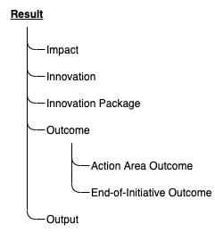
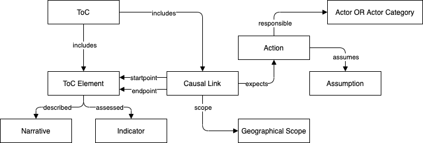

# ToC Tool Data Model

The present report lays out the basic concepts and core design principles informing the semantic model over which the ToC Tool is built. The model is expressed using the [OWL W3C specification](https://www.w3.org/OWL/) and is used in the GraphDB database that is part of the ToC Tool backend, along with the corresponding tests for data integrity and conformance to the model.

## Basic concepts

The workflow of the ToC Tool is organized around the concept of *ToC Flows*, i.e., sets of Theories of Change of different levels referring to a specific *Programme*. Figure 1 depicts the core entities involved in the definition of a ToC Flow. A flow is created by a set of *ToC Users*, comprising a team with its members participating with different capacities in the creation (Leader, Co-leader, Member, Reviewer, Stakeholder). The programme associated with the flow can be an *Initiative*, a *Project* or a *Proposal*. CGIAR programmes are explicitly differentiated via the `is_cgiar_programme` boolean property.

Finally, a TOC Flow potentially includes different *Theories of Change* (ToCs), each of one of the following levels: Action Area-level, Initiative-level, Work Package Level or Sub-level. The latter type is further specialised in Country-Level and Innovation Package-Level TOCs. The current version of the ToC tool supports the definition of Initiative-level and Work Package-level ToCs.

## ToC Elements

A ToC defines the associations between different *Results*, *Goals* and *Targets* at different levels, indicative the causal relations between the connected entities. The model includes the definition of UN *Sustainable Development Goals*, of the respective *SDG Targets* and of *CGIAR Targets*, while also supporting the definition of custom targets. Regarding results, the hierarchy of the result types covered by the model is depicted below.

All ToC entities have manifestations independently of their participation in TOCs. Thus, the model defines the relevant Classes representing these elements as autonomous entities, as well as Classes that define ToC-specific entities referring to these autonomous elements. As an example, a given SDG is defined as an instanstiation of the `Sustainable Development Goal` class of the model. When it is used within a ToC, an instance of a different class, `SdgTocEntity` is used, with its `refers_to_sdg` property having the `Sustainable Development Goal` instance as its value.

Elements within a ToC are also linked with one or more *Indicators*. The indicators are further specialised in *Result Indicators* and *Target Indicators* and carry the set of properties defined by CGIAR, namely a `unit`, a `geographic scope` (Countries or Regions), the used `data source` and the respective `data collection method` and `data collection frequency`, the `baseline value` at the `baseline year`, and finally the `target value` for the `target year`.

A ToC also defines the *Causal Links* between the entities included in the ToC. Each causal link defines the transition between its `startpoint` and `endpoint` ToC elements. The transition is realised via a set of one or more *Actions* by some *Actor* or, more generally, an *Actor Category* in a specific *Geographical Scope* (one or more countries or regions). Each Action is also linked to one or more *Assumptions*, required to stand for the transition to be realised.

Additionally, users creating the ToC can define *Impact Pathways* by grouping ToC elements present in the ToC and declaring them as constituents of the specific pathway.

Finally, all ToC entities carry a *Narrative*, which briefly describes their meaning and the rationale for being included in the ToC.

The following figure summarises the main constituents of a ToC using the entities defined by the ToC tool data model.

## ToC Flow Elements

Apart from the definition of ToCs, the tool's model defined the entities required for setting up and realising a ToC Flow. As mentioned above,  each Flow is processed by a *ToC Flow Team* with *ToC Flow Users* contributing with different *User Roles*. The Flow is associated with a *Programme* and, potentially, with the *Work Packages* entailed in the Programme. If the leaders wishes to, it can provide access to an external tool for setting up a *Participatory Development Board*. During the ToC creation process, users can provide *Comments* on all different ToC elements and the ToC as a whole. Special dinstinction is foreseen for *Reviewer Comments* and *Stakeholder Comments*, i.e. comments provided by users carrying the respective roles in the Team.

Finally, each Flow entails a *Flow Review* entity that encapsulates *ToC Reviews* with comments and ratings for all ToCs included in the Flow.

## Formal model definition

The TOC Tool Data Model is formally expressed as an [OWL ontology](./toc.owl), available via the tool's repository. A visualisation that allows browsing the model is also provided.